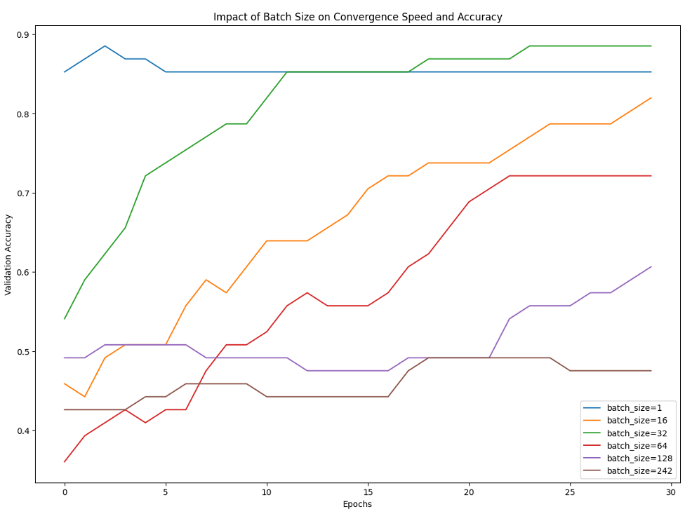
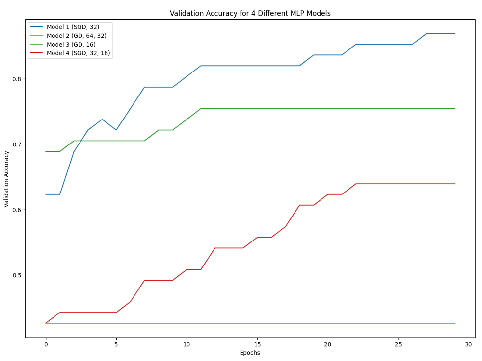
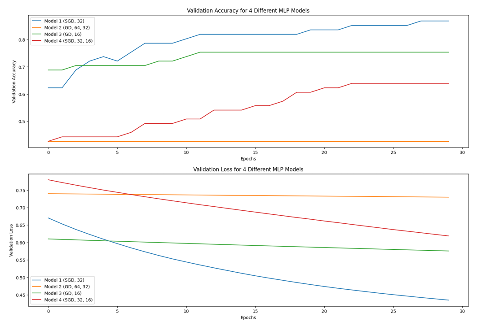

# Heart-Disease-Classification-using-MLP

##  Project Overview
This project focuses on building, training, evaluating, and optimizing **Multi-Layer Perceptron (MLP)** neural networks for the **Heart Disease Cleveland Dataset**.  
Several experiments were conducted to analyze:

- The effect of **batch size** on convergence and accuracy  
- Comparison of **four different MLP architectures**  
- Hyperparameter optimization using **GridSearchCV**  
- Hyperparameter optimization using **RandomizedSearchCV**

All experiments are based on the dataset:

Heart_disease_cleveland_new.csv

Python notebooks included in the project:

MLP_HeartDisease_4_Models.ipynb
MLP_HeartDisease_Optimized_GridSearchCV.ipynb
MLP_HeartDisease_Optimized_RandomizedSearchCV.ipynb

---

# Libraries Used  

### **• NumPy**
Matrix operations, numerical computations, random number generation.

### **• Pandas**
Loading, cleaning, preprocessing structured data.

### **• Scikit-Learn**
Preprocessing, train/test splitting, model evaluation,  
hyperparameter search (`GridSearchCV`, `RandomizedSearchCV`).

### **• SciKeras**
Bridges Keras models with Scikit-Learn pipelines.

### **• TensorFlow / Keras**
Building and training neural networks (Sequential, Dense layers, SGD, Adam).

### **• Matplotlib**
Plotting accuracy, loss, and experiment analysis.

---

#  Experiment Section 1 — Effect of Batch Size  
The first experiment investigates how various batch sizes affect:

- Convergence speed  
- Final accuracy  
- Stability of training  

Batch sizes tested:

1, 16, 32, 64, 128, 242 (full batch)

###  **Impact of Batch Size on Convergence Speed & Accuracy**

###  Key Findings:
- **Batch size = 1**  
  - Fastest convergence, accuracy reaches ~90% early  
  - Highly unstable → prone to overfitting  

- **Batch size = 16**  
  - One of the best configurations (~85% accuracy)  
  - Fast, stable, balanced updates  

- **Batch sizes 32 & 64**  
  - Lower accuracy (<80%)  
  - Slower convergence  

- **Batch sizes 128 & 242**  
  - Very slow and unstable  
  - Model fails to learn effectively  

---

#  Experiment Section 2 — Comparison of Four MLP Architectures

Four different neural network configurations were trained & evaluated.

###  Validation Accuracy of 4 MLP Models

###  Validation Loss of 4 MLP Models

---

##  **Model-by-Model Summary**

### **Model 1 — (SGD, 32 neurons)**
- Best accuracy (~85%)
- Fast and stable convergence  
- Simple architecture with 1 hidden layer  

### **Model 2 — (GD, 64–32 neurons)**
- Slowest convergence  
- Very low accuracy (~50%)
- Deeper architecture does *not* match dataset → poor generalization  

### **Model 3 — (GD, 16 neurons)**
- Moderate performance (~75%)
- Underfitting due to small hidden layer  

### **Model 4 — (SGD, 32–16 neurons)**
- Reasonable convergence  
- Lower accuracy (~70%)  
- Adding depth reduced performance  

---

#  General Conclusions from Sections 1 & 2

###  Best Batch Sizes  
`16` and `32` consistently outperform larger batches.

###  Best Architecture  
Simple MLP with **one hidden layer** performs best.

###  Best Optimizer  
**SGD** often works better than **GD** in this dataset.

###  More layers ≠ better  
Extra hidden layers caused **overfitting** and reduced accuracy.

---

#  Experiment Section 3 — GridSearchCV Optimization

The following hyperparameters were searched:

- Activation function  
- Hidden layer sizes  
- Neurons  
- Batch size  
- Optimizer  
- Learning rate  
- Epochs  

###  **Best Parameters Found (Grid Search)**  

### **Impact of Batch Size on Convergence Speed & Accuracy**

###  Key Findings:
- **Batch size = 1**  
  - Fastest convergence, accuracy reaches ~90% early  
  - Highly unstable → prone to overfitting  

- **Batch size = 16**  
  - One of the best configurations (~85% accuracy)  
  - Fast, stable, balanced updates  

- **Batch sizes 32 & 64**  
  - Lower accuracy (<80%)  
  - Slower convergence  

- **Batch sizes 128 & 242**  
  - Very slow and unstable  
  - Model fails to learn effectively  

---

#  Experiment Section 2 — Comparison of Four MLP Architectures

Four different neural network configurations were trained & evaluated.

###  Validation Accuracy of 4 MLP Models

###  Validation Loss of 4 MLP Models

---

##  **Model-by-Model Summary**

### **Model 1 — (SGD, 32 neurons)**
- Best accuracy (~85%)
- Fast and stable convergence  
- Simple architecture with 1 hidden layer  

### **Model 2 — (GD, 64–32 neurons)**
- Slowest convergence  
- Very low accuracy (~50%)
- Deeper architecture does *not* match dataset → poor generalization  

### **Model 3 — (GD, 16 neurons)**
- Moderate performance (~75%)
- Underfitting due to small hidden layer  

### **Model 4 — (SGD, 32–16 neurons)**
- Reasonable convergence  
- Lower accuracy (~70%)  
- Adding depth reduced performance  

---

#  General Conclusions from Sections 1 & 2

###  Best Batch Sizes  
`16` and `32` consistently outperform larger batches.

###  Best Architecture  
Simple MLP with **one hidden layer** performs best.

###  Best Optimizer  
**SGD** often works better than **GD** in this dataset.

###  More layers ≠ better  
Extra hidden layers caused **overfitting** and reduced accuracy.

---

#  Experiment Section 3 — GridSearchCV Optimization

The following hyperparameters were searched:

- Activation function  
- Hidden layer sizes  
- Neurons  
- Batch size  
- Optimizer  
- Learning rate  
- Epochs  

###  **Best Parameters Found (Grid Search)**  

Activation: tanh
Batch Size: 16
Epochs: 30
Hidden Layers: 1
Neurons: [32, 16]
Learning Rate: 0.0095
Optimizer: adam
Best Accuracy: 0.8098 (~80.98%)

###  Interpretation
- **tanh** works better when data normalization matches its range  
- Learning rate is slightly higher → faster convergence  
- Architecture with 2 small layers performs well  
- Adam again best optimizer  

---

# 🏁 Final Overall Conclusions

### 🔹 Batch Size  
Batch size **16** consistently gives the best results.

### 🔹 Network Architecture  
Simpler networks (1 hidden layer) outperform deeper ones.

### 🔹 Optimizer  
Adam > SGD > GD in most cases.

### 🔹 Activation  
ReLU and Tanh both perform well depending on LR and architecture.

### 🔹 Recommendation  
For further improvement:
- Ad
- d **Dropout**  
- Add **Batch Normalization**  
- Test deeper architectures with regularization  

---

